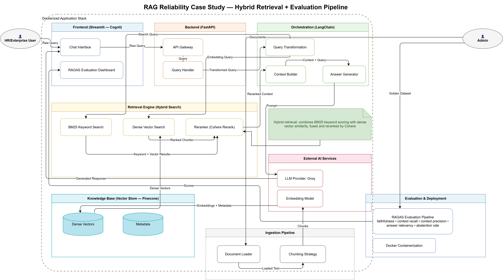

# architecture/

This folder holds the system architecture diagram for the RAG pipeline.

## Contents

- **`architecture.svg`** — Vector version of the diagram (renders natively in GitHub markdown, stays crisp at any zoom)
- **`architecture.png`** — Raster fallback for viewers that don't render SVG

## What the diagram shows

The diagram illustrates the full request and ingestion flow across the Dockerized application stack:

1. **Frontend (Streamlit — Cognit)** — Chat interface and RAGAS evaluation dashboard
2. **Backend (FastAPI)** — API gateway and query handling
3. **Orchestration (LangChain)** — Query transformation, context building, and answer generation
4. **Hybrid Retrieval** — Parallel BM25 keyword search and dense vector search, merged and reranked via Cohere
5. **Knowledge Base (Pinecone)** — Dense vector and metadata storage
6. **Ingestion Pipeline** — Document loading and chunking, feeding the vector store
7. **External AI Services** — Groq as the LLM provider, plus the embedding model
8. **Evaluation & Deployment** — RAGAS evaluation pipeline (faithfulness, context recall, context precision, answer relevancy, abstention rate) and Docker containerization

Referenced in the main [README.md](../README.md) and [CASE_STUDY.md](../CASE_STUDY.md).
